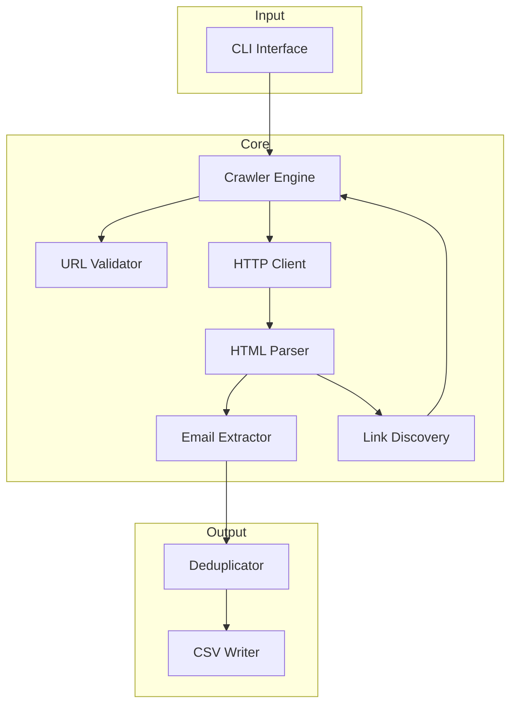

# Design Document: Email Extractor

## Overview

The Email Extractor is a command-line tool that recursively crawls websites to extract email addresses and saves them to a CSV file. The tool starts from a user-provided URL, follows same-domain links up to a configurable depth, identifies email patterns in page content, deduplicates results, and outputs them in a structured CSV format.

The system is built with a modular architecture separating concerns: URL validation, HTTP fetching, HTML parsing, email extraction, link discovery, crawl management, and CSV output.

## Architecture



### Data Flow

1. User provides target URL and optional parameters via CLI
2. Crawler validates URL and initializes crawl queue
3. For each URL in queue:
   - HTTP Client fetches page content
   - HTML Parser extracts text and links
   - Email Extractor identifies email patterns
   - Link Discovery finds same-domain links to add to queue
4. Deduplicator removes duplicate emails
5. CSV Writer saves results to output file

## Components and Interfaces

### CLI Interface
- Parses command-line arguments
- Validates user input
- Displays progress and results

```typescript
interface CLIOptions {
  url: string;           // Target URL to crawl
  output: string;        // Output CSV file path
  depth?: number;        // Max crawl depth (default: 3)
}
```

### URL Validator
- Validates URL format
- Extracts domain for same-domain comparison

```typescript
interface URLValidator {
  isValid(url: string): boolean;
  getDomain(url: string): string;
  isSameDomain(url1: string, url2: string): boolean;
  normalizeURL(url: string): string;
}
```

### HTTP Client
- Fetches web page content
- Handles connection errors and timeouts

```typescript
interface HTTPClient {
  fetch(url: string): Promise<HTTPResponse>;
}

interface HTTPResponse {
  status: number;
  body: string;
  error?: string;
}
```

### HTML Parser
- Parses HTML content
- Extracts text content for email search
- Extracts anchor tags for link discovery

```typescript
interface HTMLParser {
  parse(html: string): ParsedHTML;
}

interface ParsedHTML {
  textContent: string;
  links: string[];
}
```

### Email Extractor
- Identifies email patterns in text
- Validates email format

```typescript
interface EmailExtractor {
  extract(text: string): string[];
  isValidEmail(email: string): boolean;
}
```

### Link Discovery
- Filters links to same-domain only
- Normalizes URLs to avoid duplicates

```typescript
interface LinkDiscovery {
  discoverLinks(links: string[], baseDomain: string, baseURL: string): string[];
}
```

### Crawler Engine
- Manages crawl queue and visited URLs
- Coordinates all components
- Enforces depth limits

```typescript
interface CrawlerEngine {
  crawl(startURL: string, maxDepth: number): Promise<ExtractionResult[]>;
}

interface CrawlState {
  queue: Array<{url: string; depth: number}>;
  visited: Set<string>;
  results: ExtractionResult[];
}
```

### Deduplicator
- Removes duplicate emails (case-insensitive)
- Checks against existing file content

```typescript
interface Deduplicator {
  deduplicate(results: ExtractionResult[], existingEmails?: string[]): ExtractionResult[];
}
```

### CSV Writer
- Writes results to CSV format
- Handles special character escaping
- Supports append mode

```typescript
interface CSVWriter {
  write(results: ExtractionResult[], filePath: string, append: boolean): void;
  read(filePath: string): ExtractionResult[];
  serialize(results: ExtractionResult[]): string;
  parse(csv: string): ExtractionResult[];
}
```

## Data Models

### ExtractionResult
Represents a single extracted email with its source.

```typescript
interface ExtractionResult {
  email: string;      // The extracted email address
  sourceURL: string;  // URL where the email was found
}
```

### CrawlConfig
Configuration for the crawl operation.

```typescript
interface CrawlConfig {
  startURL: string;
  maxDepth: number;
  outputPath: string;
}
```


## Correctness Properties

*A property is a characteristic or behavior that should hold true across all valid executions of a system-essentially, a formal statement about what the system should do. Properties serve as the bridge between human-readable specifications and machine-verifiable correctness guarantees.*

### Property 1: Invalid URL Rejection
*For any* string that does not conform to valid URL format, the URL validator SHALL return false and the system SHALL not attempt to fetch it.
**Validates: Requirements 1.2**

### Property 2: Valid Email Extraction
*For any* HTML content containing valid email addresses (standard format, with subdomains, or with special characters like dots and plus signs), the email extractor SHALL identify and return all valid emails present in the content.
**Validates: Requirements 3.1, 3.2, 3.3**

### Property 3: Invalid Email Rejection
*For any* string that does not conform to basic RFC 5321 email format, the email extractor SHALL not include it in the extraction results.
**Validates: Requirements 3.4**

### Property 4: Same-Domain Link Discovery
*For any* HTML content containing hyperlinks and a base domain, the link discovery component SHALL return only links that belong to the same domain as the base.
**Validates: Requirements 2.1**

### Property 5: Visited URL Tracking
*For any* sequence of URLs processed by the crawler, each unique URL SHALL be processed at most once, regardless of how many times it appears in discovered links.
**Validates: Requirements 2.3**

### Property 6: Depth Limiting
*For any* crawl operation with a specified maximum depth, no URL at a depth greater than the maximum SHALL be processed.
**Validates: Requirements 2.4**

### Property 7: CSV Round-Trip
*For any* list of extraction results (including those with special characters in emails or URLs), serializing to CSV and then parsing back SHALL produce an equivalent list of results.
**Validates: Requirements 4.5, 4.6**

### Property 8: CSV Row Count
*For any* list of extraction results, the serialized CSV output SHALL contain exactly one data row per result (plus one header row).
**Validates: Requirements 4.3**

### Property 9: Case-Insensitive Deduplication
*For any* list of emails where some differ only in letter case, the deduplicator SHALL treat them as duplicates and return only unique emails (case-insensitively).
**Validates: Requirements 5.1, 5.3**

## Error Handling

### URL Validation Errors
- Malformed URLs return descriptive error messages
- Missing protocol (http/https) triggers validation failure

### Network Errors
- Connection timeouts return error with URL context
- HTTP error status codes (4xx, 5xx) are logged and crawl continues
- Unreachable hosts return connection failure message

### Parsing Errors
- Malformed HTML is handled gracefully with best-effort parsing
- Empty responses are treated as pages with no content

### File I/O Errors
- Permission denied errors are reported with file path
- Disk full errors are reported clearly

## Testing Strategy

### Technology Stack
- **Language**: TypeScript with Node.js
- **HTTP Client**: node-fetch (for fetching web pages)
- **HTML Parsing**: cheerio (for parsing HTML and extracting links)
- **CSV Handling**: Built-in string manipulation with proper escaping
- **CLI**: commander (for command-line argument parsing)
- **Testing Framework**: Vitest
- **Property-Based Testing**: fast-check

### Unit Tests
Unit tests will cover:
- URL validation edge cases (missing protocol, special characters)
- Email regex pattern matching for specific examples
- CSV escaping for known special character combinations
- Link normalization (relative to absolute URL conversion)

### Property-Based Tests
Property-based tests will verify the correctness properties defined above. Each property test will:
- Use fast-check to generate random inputs
- Run a minimum of 100 iterations per property
- Be tagged with the corresponding property number and requirements reference

Format for property test annotations:
```typescript
// **Feature: email-extractor, Property 1: Invalid URL Rejection**
// **Validates: Requirements 1.2**
```

### Test Organization
```
src/
├── validators/
│   ├── url-validator.ts
│   └── url-validator.test.ts
├── extractors/
│   ├── email-extractor.ts
│   └── email-extractor.test.ts
├── parsers/
│   ├── html-parser.ts
│   └── html-parser.test.ts
├── crawler/
│   ├── crawler-engine.ts
│   ├── link-discovery.ts
│   └── crawler.test.ts
├── output/
│   ├── csv-writer.ts
│   ├── deduplicator.ts
│   └── output.test.ts
└── index.ts
```
